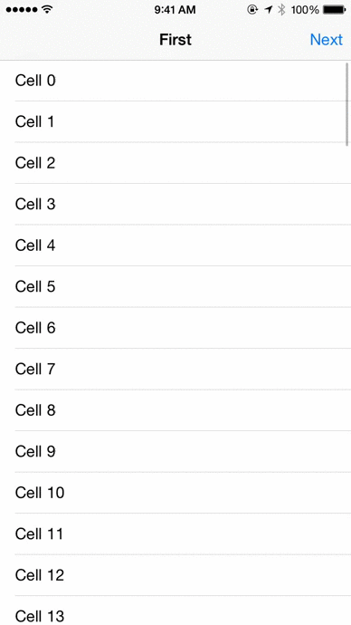
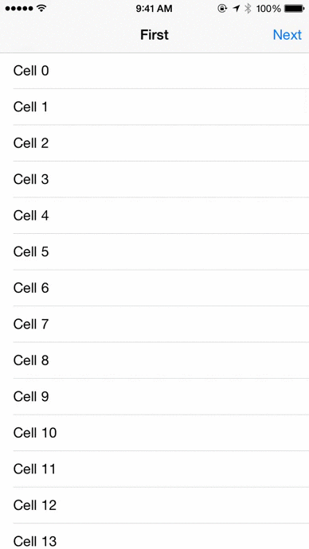
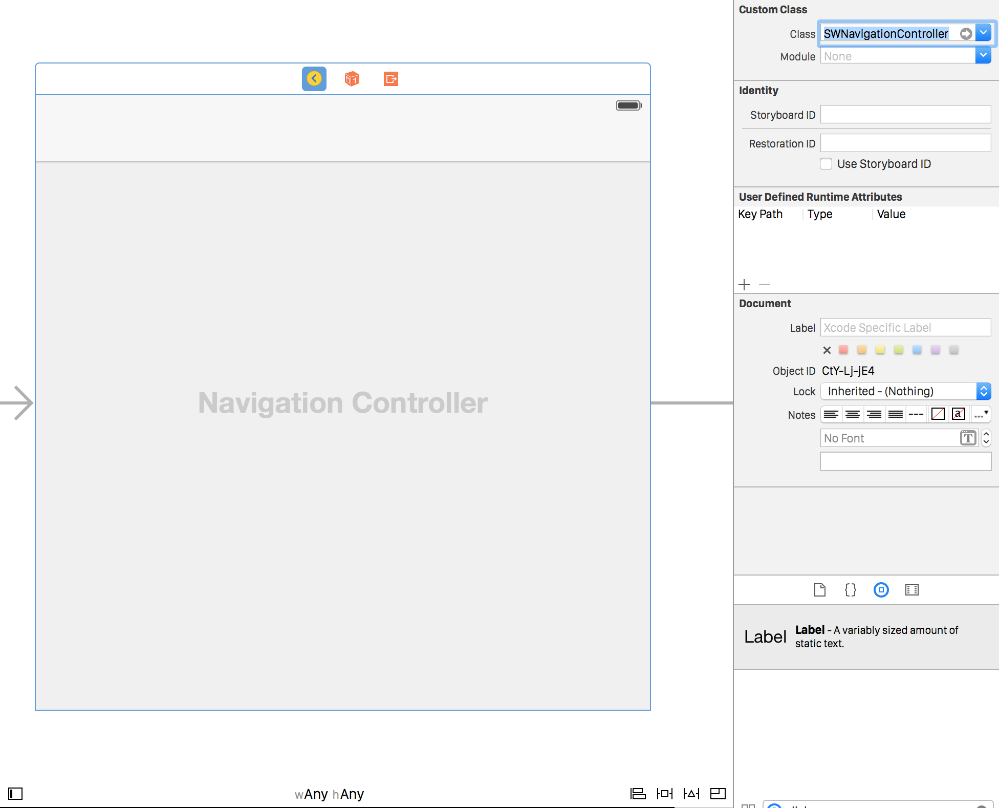

SWNavigationController
======================

<p align="center"> </p>

A UINavigationController subclass and corresponding UINavigationControllerDelegate that implements drop-in support for swiping left and right through a view hierarchy.

##Installation
In your Podfile:
<pre>pod 'SWNavigationController' </pre>

Or just close this repo and manually add the files from the `PodFiles` directory to your project

##Functionality

```objc
@property (nonatomic, strong, readonly) UIGestureRecognizer *interactivePushGestureRecognizer;
```
`SWNavigationController` contains a interactive push gesture recognizer, which behaves opposite of `UINavigationController`'s existing interactive pop gesture recognizer. When a view controller has been popped off the navigation stack it can be pulled back onto the top of the navigation stack by a right edge swipe.

The interactive push by default attempts to behave similarly to the built-in interactive pop.

<p align="center"> </p>

```objc
@property (nonatomic, strong) Class pushAnimatedTransitioningClass;
```
`pushAnimatedTransitioningClass` can be set to override the default interactive push transition that is used by default by `SWNavigationController` when pulling from the right edge of the screen. This class must implement the protocol `UIViewControllerAnimatedTransitioning`.

```objc
@property (nonatomic, strong) Class popAnimatedTransitioningClass;
```
`popAnimatedTransitioningClass` can be set to override `UINavigationController`'s default interactive pop transition when pulling from the left edge of the screen. This class must implement the protocol `UIViewControllerAnimatedTransitioning`.

###Features
* Easy drop-in creation using either Storyboards or programmatically
* Default push transition that mimics `UINavigationController`'s pop transition
* Customizable push and pop transitions
* Easily enable and disable pulling view controllers back onto the stack
* iOS 7 and above

##Usage

To use `SWNavigationController`, simply change the type of the `UINavigationController`

* Either in your Storyboard

<p align="center"> </p>

* Or programmatically in your `AppDelegate`
```objc
- (BOOL)application:(UIApplication *)application didFinishLaunchingWithOptions:(NSDictionary *)launchOptions {
    SWNavigationController *navController = [[SWNavigationController alloc] initWithRootViewController:rootViewController];
    
    [self.window setRootViewController:navController];
    
    return YES;
}
```

##Contributing
Use [Github issues](https://github.com/cewendel/SWNavigationController/issues) to track bugs and feature requests.

##Contact

Chris Wendel

- http://twitter.com/CEWendel

## Licence

MIT 


